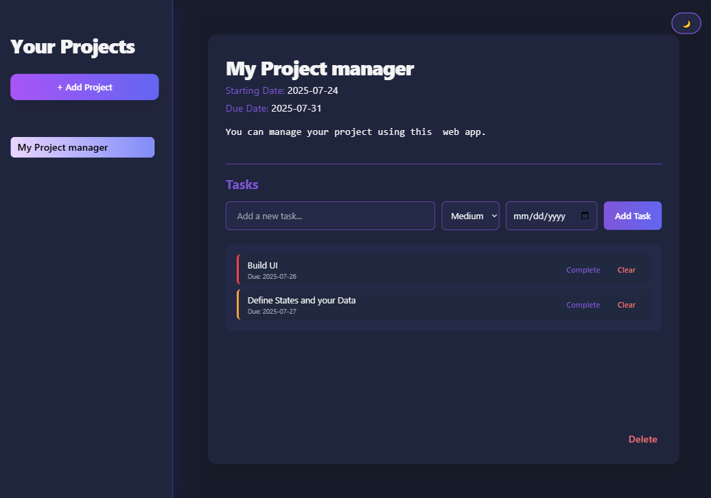
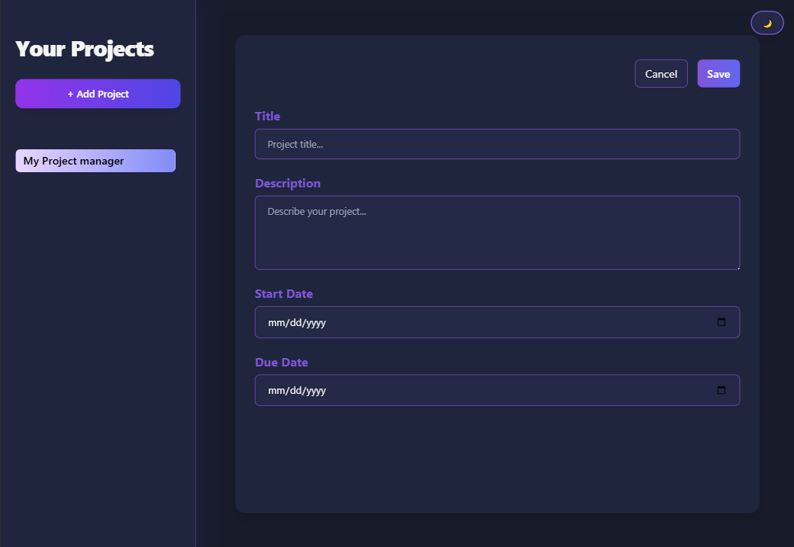

# 📁 Project Manager

A modern, browser-based productivity tool to manage your projects and tasks — built with React and Tailwind CSS.

🔗 **Live Demo:** [projectmanager-bysapientia.netlify.app](https://projectmanager-bysapientia.netlify.app/)

---

## ✨ Features

- 🗂️ Create and delete **projects**
- ✅ Add and manage **tasks** (with priority and due dates)
- ☑️ Mark tasks as **complete/incomplete**
- 🌗 **Dark/Light theme** toggle
- 💾 **Offline support** via localStorage — your data is saved even after a browser refresh

---

## 🖼️ Screenshots

| No Project View | Project View | New Project View |
|-----------------|--------------|------------------|
|  |  |  |

---

## 🛠️ Tech Stack

- ⚛️ **React** (via Vite)
- 🎨 **Tailwind CSS**
- 💽 **LocalStorage** for persistent data

---
